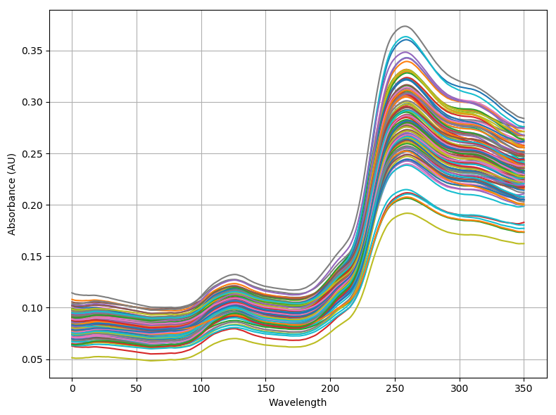

This repo is used to demo the feature engineering task for a data job interview.

#### Data source 
Chemical Spectra and near-infrared spectroscopy data sets in Tobacco industry. 
- Infra-Red (IR), Near Infra-Red (NIR) 近红外光谱 and Raman Spectroscopy (拉曼散射光谱) theory =>特征峰的波数和强度
- Sepctral analysis in chemometrics field (化学计量学).

#### Experiments, typical for classification modeling
- Find peaks of spectrum 
- supervised linear regression 
- PCA 
- SVM 
- KNN 
- CNN for deep feature extraction

**(for time limited, I only start this task from this Sunday afternoon, so much research work and code refactor is under the progress in limited deadline.)**

###### Sample wavelength of Absorbance(AU).

#### Reference
- <a href="https://www.hindawi.com/journals/jamc/2020/9652470/">Classification Modeling Method for Near-Infrared Spectroscopy of Tobacco Based on Multimodal Convolution Neural Networks</a>
- <a href="https://www.researchgate.net/publication/226296679_A_Machine_Learning_Application_for_Classification_of_Chemical_Spectra">A Machine Learning Application for Classification of Chemical Spectra</a>
- <a href="https://arxiv.org/pdf/1707.08908.pdf">Deep Learning Models for Wireless Signal Classification with Distributed Low-Cost Spectrum Sensors</a>

